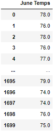
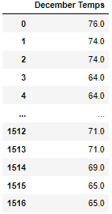

# surfs_up

## Overview of the analysis:
---

Looking to start my new business in Hawaii, selling surf gear and ice cream, I've gotten an investors attention to get this startup off the ground. W. Avy, my new investing partner had some concerns about the locale and specifically the weather on the islands as he had a previous venture ruined because he did not factor in the weather. After preparing the data to review temperatures and precipitation, W. Avy is now specifically interested in the temperature ranges for the months of June and December. 

## Results: 
---

Through my research, I was able to conclude these 3 main points. please also see the data summaries below.

    1. The average temperature between both Jun and Dec is in the low 70's with less than a 4 degree change across the seasons.

    2. The max temperature has even less change, with the max temperatures at 83 and 85 degrees.

    3. the minimum temperature was where we saw the largest deviation between Jun and Dec with an 8 degree difference.

 

## Summary: 
---

Overall the temperature data outlines a positive outcome at first glance, but further exploration is needed before a final conclusion can be formulated.

    1. What is the precipitation level between June and December?
    2. How has the temperature and precipitation changed year to year? 

Providing information based on these two additional queries can help make a more informed decision before fully investing in my new Surf and Shake storefront.